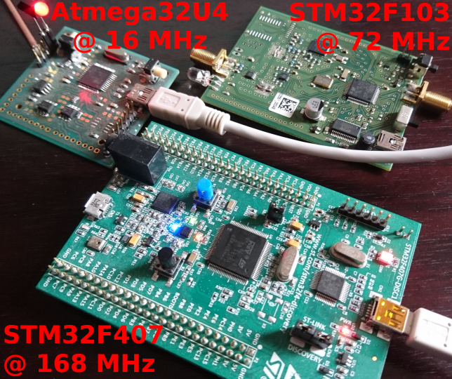
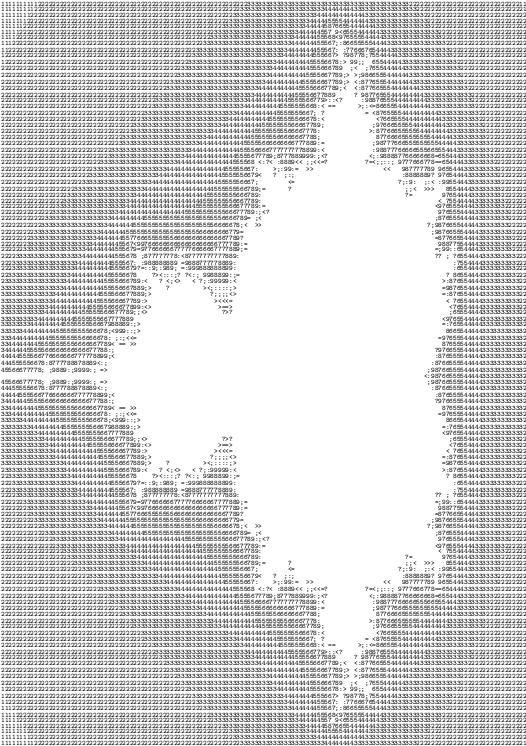
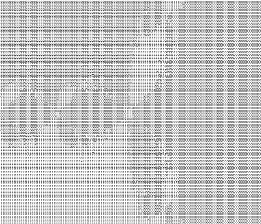

# arithmetique
embedded system fixed point fractal calculation: archive accompanying the 
article published in GNU/Linux Magazine France

The objective is to demonstrate fixed point arithmetic and portable code 
organization separating algorithm (mandelbrot.c and newton.c) from the
low level peripheral access. This example runs on STM32 Cortex-M3 ARM
(STM32F103), STM32 Cortex-M4 STM32F407 Discovery board, Atmel/Microchip 
Atmega32U4, and of course the host PC.

Link (``ln -s`` for a symbolic link) the Makefile for the targetted
architecture to the name ``Makefile`` and run ``make``. Select
``-Dfl`` to activated floating point calculation, otherwise
fixed point calculation is used.

Family picture, result of Mandelbrot and Newton fractals computed on the microcontrollers
with ASCII output on the UART.

